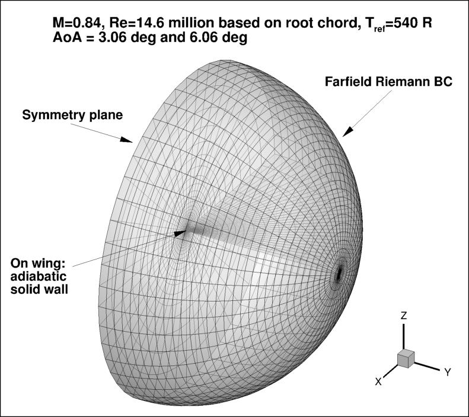

NASA 网格生成程序
===============================

NASA `Turbulence Modeling Resource <https://turbmodels.larc.nasa.gov/index.html>`_ 提供了大量实验和数值模拟数据。其中，
`3D Hemisphere Cylinder Validation Case <https://turbmodels.larc.nasa.gov/hc3dnumericspart2_val.html>`_ 和
`3D ONERA M6 Wing Validation Case <https://turbmodels.larc.nasa.gov/onerawingnumerics_val.html>`_ 
两个示例中提供了三维网格的生成程序 Fortran 代码。

代码说明和示例
--------------------------------

以 ONERA M6 机翼为例 (:numref:`ONERA_M6`), NASA 提供了 :numref:`ONERA_M6_grid` 所示的网格生成程序。
该程序在 `AIAA-2018-1101 <https://doi.org/10.2514/6.2018-1101>`_ 中进行了介绍。
报告 `Hemisphere/Wing Grid Generation Codes <http://ossanworld.com/hiroakinishikawa/My_papers/nishikawa_diskin_aiaa2018-1101_presentation_v3.pdf>`_
中也对以上程序进行了介绍。
代码链接为 `wing_release_072319.tar.gz <https://turbmodels.larc.nasa.gov/Onerawingnumerics_grids/wing_release_072319.tar.gz>`_。

.. note:: 

    此代码只能生成对称翼型的后掠机翼（结构、非结构）网格。

    This code generates a 3D grid over a wing generated by a NACA00XX airfoil
    or by an airfoil defined by a set of discrete points (e.g., OM6 wing).

    The wing grids are topologically equivalent to the hemisphere-cylinder grids. 

    In the mesh generation process, a surface mesh for a full-geometry hemisphere-cylinder configuration is generated first. 
    This surface mesh is then mapped onto a wing: the cylinder is mapped onto the main wing and the hemisphere is mapped onto the wing tip. 
    Each surface node is projected onto the airfoil section profile.

.. code-block:: bash

    # Compile the HC-family grid generation program
    gfortran -o hcf_wing hcf_wing_v5p0.f90

    # Compile the coarsening program
    gfortran -o hc_coarsening hcf_coarsening_v3p9.f90

    # Generate a fine structured grid
    # read in input.nml
    ./hcf_wing

    # Generate coarse grids from the grid just generated
    # read in input_coarsen.nml
    ./hcf_coarsening

    # Convert .ugrid+.mapbc file to a CGNS file,
    # where $HOME/cgnslib/ is the directory of the CGNS library installed.
    %$HOME/cgnslib/bin/cgnstools/aflr3_to_cgns xxx.b8.ugrid xxx.cgns

.. _ONERA_M6:
.. figure:: figures/view-of-ONERA-M6.jpg
    :width: 50 %
    :align: center

    `ONERA M6 <https://turbmodels.larc.nasa.gov/Onerawingnumerics_grids/view-of-ONERA.jpg>`_

.. _ONERA_M6_grid:

    `ONERA M6 Grid <https://turbmodels.larc.nasa.gov/Onerawingnumerics_grids/onera_bcs.jpg>`_

控制文件
--------------------------------

控制文件示例参见网站 `3D ONERA M6 Wing Validation Case <https://turbmodels.larc.nasa.gov/onerawingnumerics_val.html>`_ 。

机翼网格生成的控制文件 input.nml:

.. include:: codes/input.nml
   :literal:

稀网格转换的控制文件 input_coarsen.nml:

.. include:: codes/input_coarsen.nml
   :literal:

