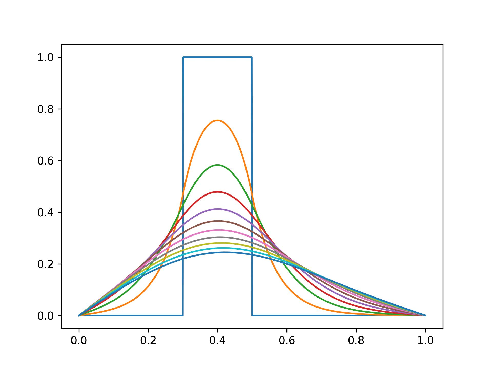

示例 1: 一维热传导方程
===========================

(1) 控制方程
---------------------------

无量纲控制方程为 :eq:`norm-diff`, :math:`x \in [0,1]`。

.. math:: 
    \frac{\partial u}{\partial t} = \frac{\partial^2 u}{\partial x^2}
   :label: norm-diff

初始条件为单个方波，即：

.. math:: 
   u(x, t=0) = 
   \left\{
      \begin{array}{lr}
         0, & x \le 0.3\\
         1, & x \in (0.3,0.5) \\
         0, & x \ge 0.5\\
      \end{array}
   \right.
   :label: init-condition-1

边界条件为零阶条件 (Dirichlet boundary conditions)，即：

.. math:: 
   u(x=0, t) = u(x=1, t) = 0
   :label: boundary-condition-1

(2) 离散方法
---------------------------

- 有限差分方法
- 均匀结构网格
- 全离散方法
- 一阶隐式时间推进
- 二阶中心差分空间离散

离散方程：

.. math:: 
    \frac{\hat u_i - u_i}{\Delta t} = 
    \frac{\hat u_{i+1} - \hat u_{i} + \hat u_{i-1}} {\Delta x^2}
   :label: discrete-eqn-1

其中，:math:`\hat u` 为下一时间步的解，
:math:`\Delta t, \Delta x` 为离散单元，:math:`i` 为网格点编号。

那么，由 :eq:`discrete-eqn-1` 可得隐式时间推进的单时间步方程为：

.. math:: 
   \hat u_i + \Delta t / \Delta x^2 
   (\hat u_{i+1} - \hat u_{i} + \hat u_{i-1}) = u_i
   :label: discrete-eqn-move-1

则 :eq:`discrete-eqn-move-1` 可以写为线性方程组形式 :math:`A\mathbf{u}=\mathbf{b}`, 
其中 :math:`A` 是一个近似三对角形式的方阵，
:math:`\mathbf{u}` 是下一时间步的未知解向量，
:math:`\mathbf{b}` 是当前时间步的解向量。

(3) 数值求解模块
---------------------------

使用 `petsc4py` 求解线性方程组 :eq:`discrete-eqn-move-1`, 
PETSc 的线性求解器可以在运行时指定：

.. code-block:: bash
   :linenos:
   
   # Use this flag to monitor the solution process:
   python example_01.py -ksp_monitor

   # Use this flag to swap the linear solver
   python example_01.py -ksp_type [SOLVER_NAME]

(4) 代码示例
---------------------------

以下为完整代码。

.. include:: codes/example_01.py
   :literal:

(5) 结果展示
---------------------------

   多个时间步的温度分布
