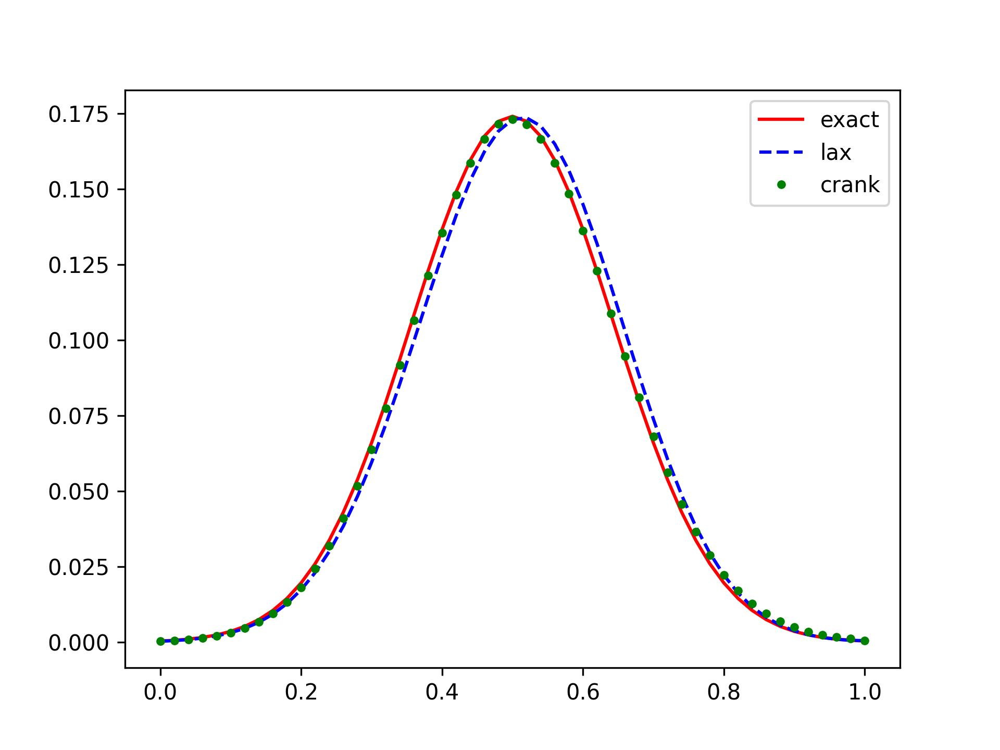

示例 2: 一维对流扩散方程
===========================

(1) 控制方程
---------------------------

考虑不可压缩流体 :math:numref:`conv-diff-simple`, 写为无量纲形式：

.. math:: 
   \frac{\partial u}{\partial t} = \alpha \frac{\partial^2 u}{\partial x^2}
   - a \frac{\partial u}{\partial x}
   :label: norm-conv-diff

其中，:math:`u` 是被输运物质的浓度，流动速度 :math:`a=1.0`,
扩散系数 :math:`\alpha=0.01`, :math:`x \in [0,1]`, :math:`t \in [0,1]`。

初始条件和边界条件为：

.. math:: 
   & \left\{
        \begin{array}{lr}
            u(x,0) = \exp \left( - \frac{(x+0.5)^2}{0.00125} \right) \\
            u(0,t) = \frac{0.025}{\sqrt{0.000625+0.02t}} 
            \exp \left( - \frac{(0.5-t)^2}{0.00125+0.04t} \right) \\
            u(1,t) = \frac{0.025}{\sqrt{0.000625+0.02t}} 
            \exp \left( - \frac{(1.5-t)^2}{0.00125+0.04t} \right) \\
      \end{array}
   \right.
   :label: initial-boundary-condition

精确解为：

.. math:: 
   u(x,t) = \frac{0.025}{\sqrt{0.000625+0.02t}}
   \exp \left( - \frac{(x+0.5-t)^2}{0.00125+0.04t} \right)
   :label: exact-solution

.. seealso::

   `[1] Numerical Solution of the 1D Advection-Diffusion Equation
   Using Standard and Nonstandard Finite Difference Schemes, 
   A. R. Appadu, Journal of Applied Mathematics, 2013,
   <https://downloads.hindawi.com/journals/jam/2013/734374.pdf>`_

(2) 离散方法
---------------------------

- 有限差分方法
- 均匀结构网格
- 全离散方法
- 显式/隐式时间推进
- 一阶空间离散

记 :math:`\gamma` 为空间加权系数，:math:`\phi` 为时间加权系数。

时间导数的一阶差分：

.. math:: 
   \frac{\partial u}{\partial t} \approx
   \frac{\hat u_i- u_i}{\Delta t}
   :label: temporal-diff

空间一阶导数的迎风格式：

.. math:: 
   \frac{\partial u}{\partial x} \approx
   (1-\phi) \left[\frac{(1-\gamma)(u_i- u_{i-1})
   +\gamma(u_{i+1}-u_i)}{\Delta x}\right] \\
   + \phi \left[\frac{(1-\gamma)(\hat u_i- \hat u_{i-1})
   +\gamma(\hat u_{i+1}- \hat u_i)}{\Delta x}\right]
   :label: spatial-diff-1

空间二阶导数的中心差分：

.. math:: 
   \frac{\partial^2 u}{\partial x^2} \approx
   (1-\phi) \left[ \frac{u_{i+1}-2u_i+u_{i-1}}{\Delta x^2} \right] 
   + \phi \left[ \frac{\hat u_{i+1}-2 \hat u_i+ \hat u_{i-1}}{\Delta x^2} \right]
   :label: spatial-diff-2

将 :eq:`spatial-diff-1` 和 :eq:`spatial-diff-2` 代入 :eq:`norm-conv-diff`, 
则显式/隐式格式统一表达为：

.. math::
   \hat u_i = \frac{1}{A_0}
   (A_1 u_{i-1} + A_2 u_{i} + A_3 u_{i+1}
   + A_4 \hat u_{i-1} + A_5 \hat u_{i+1})
   :label: uniform-eqn

.. math::
   A_0 &= 1 - \phi [c(2\gamma-1)-2s], & A_1 = (\phi-1)[c(\gamma-1)-s],\\
   A_2 &= 1 + (\phi-1)[c(1-2\gamma)+2s], & A_3 = (1-\phi)[s-c\gamma], \\
   A_4 &= \phi [s+c(1-\gamma)], & A_5 = \phi[s-\gamma c]
   :label: uniform-eqn-coef

其中，:math:`c=a \Delta t/\Delta x`, :math:`s=\alpha \Delta t/\Delta x^2`。

(2.a) Lax-Wendroff 格式
+++++++++++++++++++++++++++

取 :math:`phi=0`, :math:`\gamma=(1-c)/2`, :eq:`uniform-eqn` 得：

.. math::
   \hat u_i = \frac{1}{2}(2s+c+c^2)u_{i-1} + (1-2s-c^2)u_i +
   \frac{1}{2}(2s-c+c^2)u_{i+1}
   :label: lax-wendroff

本格式为接近迎风格式的显式时间推进格式，
数值稳定区间为 :math:`0 < s ≤ (1-c^2)/2`。

(2.b) Crank-Nicolson 格式
+++++++++++++++++++++++++++

取 :math:`phi=1/2`, :math:`\gamma=1/2`, :eq:`uniform-eqn` 得：

.. math::
   - (c+2s) \hat u_{i-1} + (4+4s) \hat u_i + (c-2s) \hat u_{i+1} = \\
   (c+2s) u_{i-1} + (4-4s) u_{i} - (c-2s) u_{i+1}
   :label: crank-nicolson

本格式为无条件稳定隐式时间推进格式，
可以写为线性方程组形式 :math:`A\mathbf{u}=\mathbf{b}`。
其中 :math:`A` 是一个近似三对角形式的方阵，
:math:`\mathbf{u}` 是下一时间步的未知解向量，
:math:`\mathbf{b}` 是由当前时间步的解计算得到的向量。

边界条件的处理：

.. math::
   & A[0,0]=1, A[0,1]=0, \\
   & A[n,n]=1, A[n,n-1]=0, \\
   & b[0]=u(0,t), b[n]=u(1,t), n = \text{rank}(b)
   :label: boundary-matrix

(3) 代码示例
---------------------------

以下为部分代码。

.. include:: codes/example_02.py
   :literal:
   :start-line: 45
   :end-line: 137

(4) 结果展示
---------------------------

   Lax-Wendroff 和 Crank-Nicolson 与精确解的对比
