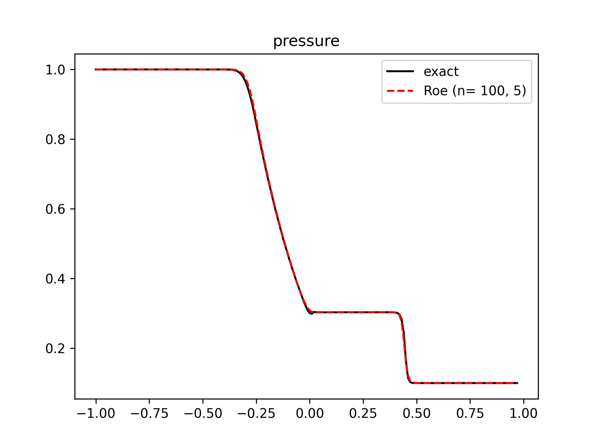

示例 2: 一维Euler方程组 (LU-SGS)
======================================

本示例演示双时间步 LU-SGS 隐式时间推进方法。

(1) 离散方法
---------------------------

- 有限体积方法
- 均匀结构网格
- 半离散方法
- 隐式时间推进 (LU-SGS, 二阶精度)
- 一阶空间离散 (ROE 格式)
- 无边界条件

一维 Euler 方程非定常流动的时间推进方程 (:eq:`implicit-dual-step-eqn`) 可写作
:eq:`implicit-dual-step-eqn-1d`:

.. math::
    \left[
    \left( \frac{1}{\Delta \tau} + \frac{1+\phi}{\Delta t} \right) \Delta x I + \delta_x A^{(m)} \right]
    \Delta \mathbf{U}^{(m)} = \text{RHS}^{(m)} \\
    = \frac{\phi     \Delta x}{\Delta t} ( \mathbf{U}^{n} - \mathbf{U}^{n-1} )
    - \frac{(1+\phi) \Delta x}{\Delta t} ( \mathbf{U}^{(m)}-\mathbf{U}^{n} )
    + \mathbf{R}(\mathbf{U}^{(m)})

其中, :math:`\phi=0.5` 时时间方向为二阶精度, :math:`\phi=0` 时为一阶精度。
:math:`\sigma_A = (1+\varepsilon)|\lambda|_{\text{max}, A_i}`, 
:math:`\varepsilon \in [0,0.01]`。
残差项 :math:`\mathbf{R}(\mathbf{U}^{(m)})` 
计算方法与显式时间推进中的处理方法相同 (式 :eq:`euler-1d-c-discrete`)。 

**L 块向前扫描运算:** (:eq:`lu-sgs-sweep-l`)

.. math::
    \Delta \mathbf{U}^*_i = \frac{ \text{RHS}^{(m)} + (A^{+} \Delta \mathbf{U})_{i-1}^{(m)} }
    { \frac{\Delta x}{\Delta \tau} + \frac{(1+\phi)\Delta x}{\Delta t} + \sigma_A }

**U 块向后扫描运算:** (:eq:`lu-sgs-sweep-r`)

.. math::
    \Delta \mathbf{U}^{(m)}_i = \Delta \mathbf{U}^*_i - \frac{ (A^{-} \Delta \mathbf{U})_{i+1}^{(m)}}
    {\frac{\Delta x}{\Delta \tau} + \frac{(1+\phi)\Delta x}{\Delta t} + \sigma_A}

(2) 代码示例
---------------------------

以下为部分代码。
其中，调用的通量和重构格式参考 :eq:`roe-flux-1-vec`, :eq:`tvd-roe-u` 相关实现。

.. tip::
    由于是二阶时间精度，相比于 `example_01` 物理时间步长必须减小。

使用结构体形式存储每个网格的数据:

.. code-block:: python
    :linenos:

    class Cell():
        '''
        Data of each cell
        '''
        def __init__(self) -> None:
            
            # conserved variables: [rho, rho u, rho E]
            # primitive variables: [rho, u, p]
            
            #* Physical step n-1
            self.U_nm1 = np.zeros(3)    # conserved variables (physical step n-1)
            
            #* Physical step n
            self.U_n = np.zeros(3)      # conserved variables (physical step n)

            #* pseudo step m
            self.U_m = np.zeros(3)      # conserved variables (pseudo step m)
            self.DU_m = np.zeros(3)     # difference of the conserved variables (pseudo step m)
            self.DU_star = np.zeros(3)  # temporal DU* after L sweep (pseudo step m)
            self.residual = np.zeros(3) # the right hand side of the dU/dt=Res
            
            self.abs_eigenvalues = np.zeros(3)  # absolute eigenvalues [abs(u+a), abs(u), abs(u-a)]
            self.lambda_max_m = 0.0             # maximum absolute eigenvalue of Jacobin A
            self.mA_m = np.zeros([3,3])         # Jacobin A = dF/dU
            
            self.pseudo_dt = 0.0        # pseudo time step
            self.ratio_lu = 0.0         # ratio of (RHS + [A+]DU) or [A-]DU
        
        @staticmethod
        def JacobinA(u: float, tE: float) -> np.ndarray:
            '''
            >>> mA = Cell.JacobinA(U[1]/U[0], U[2]/U[0])
            '''
            u2 = u**2
            gE = tE*GAMMA
            
            mA = np.zeros([3,3])
            mA[0,0] = 0
            mA[0,1] = 1
            mA[0,2] = 0
            mA[1,0] = 0.5*(GAMMA-3)*u2
            mA[1,1] = (3-GAMMA)*u
            mA[1,2] = GAMMA - 1
            mA[2,0] = (GAMMA-1)*u*u2 - gE*u
            mA[2,1] = -1.5*(GAMMA-1)*u2 + gE
            mA[2,2] = GAMMA*u
            
            return mA
        
        @staticmethod
        def JacobinA_plus (mA: np.ndarray, lambda_max_m: float, ratio=1.01) -> np.ndarray:
            return 0.5*(mA + np.eye(3)*lambda_max_m*ratio)
        
        @staticmethod
        def JacobinA_minus(mA: np.ndarray, lambda_max_m: float, ratio=1.01) -> np.ndarray:
            return 0.5*(mA - np.eye(3)*lambda_max_m*ratio)

残差项 :math:`\mathbf{R}(\mathbf{U}^{(m)})` 计算方法与显式时间推进中的处理方法相同:

.. code-block:: python
    :linenos:

    def explicit_residual(Um2, Um1, U, Up1, Up2) -> np.ndarray:
        '''
        Calculate the right hand side of the (1/J) dU/dt = Res
        '''
        uUL, uUR = Reconstruction.Upwind1_TVD(Um2, Um1, U, Up1,
                    limiter=Reconstruction.min_mod)

        fFaceL = Roe.flux_face(uUL, uUR)

        uUL, uUR = Reconstruction.Upwind1_TVD(Um1, U, Up1, Up2,
                    limiter=Reconstruction.min_mod)
        
        fFaceR = Roe.flux_face(uUL, uUR)

        res = - (fFaceR - fFaceL)
            
        return res

LU-SGS 的两次扫描过程:

.. code-block:: python
    :linenos:

    def LU_SGS(physical_dt: float, dx: float, cfl: float, cells: List[Cell], n_pseudo_steps: int, phi: float):
        '''
        Update cell.U_n (need initial U_n & U_nm1)
        '''
        #* Initialization
        for i in range(len(cells)):
            cells[i].U_m = cells[i].U_n.copy()

        #* Pseudo time iteration: L-U sweep
        for i_pseudo in range(n_pseudo_steps):

            #* Preparation of all cells (m)
            for i in range(2, N_POINTS-1):

                #* primitive variables 
                rho = cells[i].U_m[0]
                u   = cells[i].U_m[1]/rho
                tE  = cells[i].U_m[2]/rho
                p   = (GAMMA-1)*(tE-0.5*rho*u**2)
                a   = np.sqrt(GAMMA*p/rho)
                
                #* Calculate eigenvalues
                cells[i].abs_eigenvalues = np.array([abs(u+a), abs(u-a), abs(u)])
                cells[i].lambda_max_m = np.max(cells[i].abs_eigenvalues)
                
                #* Calculate pseudo_dt
                cells[i].pseudo_dt = cfl*dx/cells[i].lambda_max_m
                
                #* Calculate residual R(U(m))
                cells[i].residual = explicit_residual(
                    cells[i-2].U_m, cells[i-1].U_m, cells[i].U_m, cells[i+1].U_m, cells[i+2].U_m)
                
                #* Calculate [A]
                cells[i].mA_m = Cell.JacobinA(u, tE)
                
                #* Calculate ratio of (RHS+[A+] DU) or [A-] DU
                denominator = dx/cells[i].pseudo_dt + (1+phi)*dx/physical_dt \
                            + RATIO_LAMBDA*cells[i].lambda_max_m
                cells[i].ratio_lu = 1.0/denominator

            #* L sweep
            for i in range(2, N_POINTS-1):
                
                II = i-1

                #* Calculate [A+]
                mAp = Cell.JacobinA_plus(cells[II].mA_m, cells[II].lambda_max_m, ratio=RATIO_LAMBDA)
                
                #* Calculate RHS
                rhs  =    phi *dx/physical_dt*(cells[i].U_n-cells[i].U_nm1)
                rhs -= (1+phi)*dx/physical_dt*(cells[i].U_m-cells[i].U_n)
                rhs += cells[i].residual

                #* Calculate dU*
                numerator = rhs + np.dot(mAp, cells[II].DU_m)
                cells[i].DU_star = cells[i].ratio_lu * numerator
            
            
            #* U sweep
            for i in range(N_POINTS-1, 2, -1):
                
                II = i+1
                
                #* Calculate [A-]
                mAm = Cell.JacobinA_minus(cells[II].mA_m, cells[II].lambda_max_m, ratio=RATIO_LAMBDA)
                
                #* Calculate dU(m)
                numerator = np.dot(mAm, cells[II].DU_m)
                cells[i].DU_m = cells[i].DU_star + cells[i].ratio_lu * numerator
                
                
            #* Update conserved variables
            for i in range(2, N_POINTS-1):
                cells[i].U_m = cells[i].U_m + cells[i].DU_m
        
        
        #* Update conserved variables
        for i in range(2, N_POINTS-1):
            cells[i].U_nm1 = cells[i].U_n.copy()
            cells[i].U_n   = cells[i].U_m.copy()

        #* Residual
        residual = {}
        residual['physical-density'] = np.max([abs(cell.U_n[0] - cell.U_nm1[0]) for cell in cells[2:N_POINTS-1]])
        residual['pseudo-density']   = np.max([abs(cell.DU_m[0]) for cell in cells[2:N_POINTS-1]])
        
        return residual

    if __name__ == "__main__":
        
        phi = 0.0
        for i_physical in range(N_PHYSICAL_STEP):
            
            if i_physical >= 2:
                phi = DS_PHI
            
            residual = LU_SGS(physical_dt, DX, CFL, cells, N_PSEUDO_STEP, phi)
        
        solution = np.zeros_like(initial_solution)
        for i in range(mesh.shape[0]):
            solution[i,:] = cells[i].U_n

(3) 结果展示
---------------------------

   ROE 格式隐式时间推进与精确解的对比

