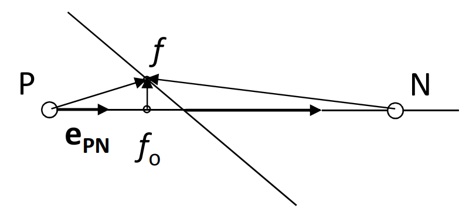
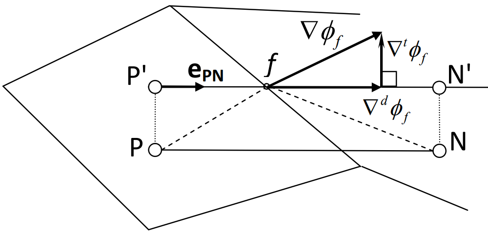
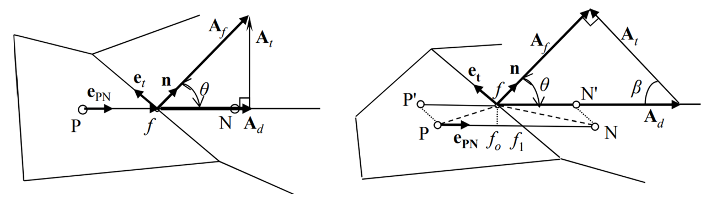

非结构网格概述
=================================

.. seealso::

    `Numerical Methods for Partial Differential Equations: FDM and FVM, Sandip Mazumder, 2016 (Chapter 7)
    <https://www.sciencedirect.com/book/9780128498941/numerical-methods-for-partial-differential-equations>`_

(1) 基本概念
---------------------------------

相比于贴体曲线结构网格有着对应的通用坐标系 (:math:`\xi, \eta, \zeta`), 坐标转换 Jacobian 矩阵 
(式 :eq:`jacobian-coordinates`) 和相应的通用坐标控制方程 (如，式 :eq:`rans-eqn-general`),
非结构网格没有隐性定义的网格坐标结构 (结构网格的通用坐标系是一个均匀笛卡尔网格)。
非结构网格通常应用于有限体积法中，使用网格中心格式。

以对流-扩散方程 (:eq:`conv-diff`) 为例, 写为网格单元 (控制体) 上的积分形式:

.. math:: 
    \frac{\partial}{\partial t} \int_V{\phi \, dV} 
    + \int_S{\mathbf{n} \cdot (\phi \mathbf{v}) dA}
    = \int_S{\mathbf{n} \cdot (\Gamma \nabla \phi) dA}
    + \int_V{S_{\phi} \, dV} 
    :label: conv-diff-integral

记 :math:`\mathbf{A}=A \mathbf{n}`, :math:`\mathbf{A}= A_x \mathbf{i} + A_y \mathbf{j} + A_z \mathbf{k}`,
:math:`| \mathbf{A} | = \sqrt{A_x^2+A_y^2+A_z^2}`。

网格面指向外侧的单位法向量 (unit outward vector normal to face) :math:`\mathbf{n}`,
网格面积向量 (face area vector) :math:`\mathbf{A}`。

网格体积 (volume) 基于 Gauss theorem 计算: 
:math:`V=\int_V \nabla(x \mathbf{i}) dV = \int_S x\mathbf{i} \cdot \mathbf{n} dA`, 得：

.. math::
    V \approx \frac{1}{3} \left[
        \sum_f x_f A_{x,f} + \sum_f y_f A_{y,f} + \sum_f z_f A_{z,f} \right]
    :label: cell-volume

其中 :math:`[x_f, y_f, z_f]` 是 :math:`f` 面中心的坐标。

假设 :math:`f` 面由 :math:`N_v` 个网格点 (vertex) 组成, 坐标为 :math:`\mathbf{v}_{i}`,
这些点按照向量 :math:`\mathbf{A}` 的 **右手原则** 排列。

那么, 网格面的面积为:

.. math::
    \mathbf{A} = \frac{1}{2} \sum_{i=3}^{N_v} 
    \left[ (\mathbf{v}_{i-1} - \mathbf{v}_1) \times
    (\mathbf{v}_{i} - \mathbf{v}_1) \right]
    :label: face-vector

网格面的中心坐标为:

.. math::
    \mathbf{x}_{c,f} = \frac{1}{N_v} \sum_{i=1}^{N_v} \mathbf{v}_i
    :label: face-center

(2) 有限体积离散形式
---------------------------------

时间导数项 (transient term), 以一阶前向为例:

.. math:: 
    \frac{\partial}{\partial t} \int_V{\phi \, dV} \approx
    \frac{\hat{\phi}\hat{V} - \phi V}{\Delta t}
    :label: unstructured-transient

扩散项 (diffusion term):

.. math::
    \int_S{(\Gamma \nabla \phi) \cdot d\mathbf{A}} \approx
    \sum_f (\Gamma \nabla \phi)_f \cdot \mathbf{A}_f
    :label: unstructured-diffusion

对流项 (convection term):

.. math::
    \int_S{(\phi \mathbf{v}) \cdot d\mathbf{A}} \approx
    \sum_f (\phi \mathbf{v})_f \cdot \mathbf{A}_f \phi_f =
    \sum_f \dot m_f \phi_f
    :label: unstructured-convection

其中, :math:`\dot m_f` 是通过面 :math:`f` 的质量流量。

源项 (source term):

.. math::
    \int_V{S_{\phi} \, dV} \approx S_{\phi} V
    :label: unstructured-source

(3) 数据结构
---------------------------------

一套非结构网格必须包含以下信息：

**几何信息** :

- 网格维度 (2D, 3D)
- 网格总数 (ncells)
- 网格面总数 (nfaces)
- 边界网格面总数 (nbfaces)
- 网格点总数 (nvertices)
- 网格中心坐标 (xc[ncells], yc[ncells], zc[ncells])
- 网格面中心坐标 (xf[nfaces], yf[nfaces], zf[nfaces])
- 网格点坐标 (xv[nvertices], yv[nvertices], zv[nvertices])
- 网格面法向向量 (fnm[nfaces, 3])
- 网格体积 (vol[ncells])
- 网格面面积 (areaf[nfaces])

**链接信息** :

- 每个网格包含的网格面 (num_face[ncells])
- 每个网格包含的网格点 (num_vertices_c[ncells])
- 每个网格面包含的网格点 (num_vertices_f[nfaces])
- 网格指向网格面的链接表 (link_cell_to_face[ncells, nfaces])
- 网格面指向网格的链接表 (link_face_to_cell[nfaces, 2])
- 网格面指向网格点的链接表 (link_face_to_vertices[nfaces, :])
- 网格指向网格点的链接表 (link_cell_to_vertices[ncells, :])
- 指定网格面是否为边界网格面的链接表 (link_face_to_bface[nfaces])
- 给出边界网格面全局编号的链接表 (link_bface_to_face[nbfaces])

**编号原则** :

- 每个网格有一个全局编号
- 每个网格面有一个全局编号
- 每个边界网格面有一个全局编号
- 每个网格点有一个全局编号
- 每个网格对它自己的网格面给出一个局部编号
- 每个网格面对它两侧的网格给出一个局部编号

(4) 网格面中心/网格点的标量插值
---------------------------------

由于数据存储在网格中心，因此网格面中心和网格点上的数据，需要进行插值。

网格面中心的反距离插值:

.. math::
    \phi_\text{fc} = \frac{\phi_L d_L + \phi_R d_R}{1/d_L+1/d_R}
    :label: interpolation-face-center

其中, :math:`d_L, d_R` 是网格面中心到两侧网格中心的距离，上式中也可以使用平方距离进行加权。

网格点通常有多个相邻的网格，其反距离插值为：

.. math::
    \phi_\text{v} = \sum_{i=1}^{N_\text{c}} w_{\text{v},i} \phi_i, \;\;
    w_{\text{v},i} = \frac{1/d_i}{\sum_{k=1}^{N_\text{c}} 1/d_k}
    :label: interpolation-vertex

(5) 网格中心的标量梯度
---------------------------------

**基于 Gauss theorem** :

.. math::
    \nabla \phi = \frac{1}{V} \int_S \phi d \mathbf{A} = \frac{1}{V} \sum_f \phi_f |\mathbf{A}_f|
    :label: cell-center-gradient-explicit

网格面中心的值 :math:`\phi_f` 可以使用反距离插值 (:eq:`interpolation-face-center`) 得到 (显式格式)。

也可以基于隐式格式全场迭代计算, 对式 :eq:`cell-center-gradient-explicit` 中每一个网格面 :math:`f`:

.. math::
    \begin{array}{l}
        \phi_f = \phi_{f_0} + \nabla \phi_{f_0} \cdot \mathbf{r}_{f_0f} & \\
        \phi_{f_0} = (1-f_P) \phi_P + f_P \phi_N, &
        \nabla \phi_{f_0} = (1-f_P) \nabla \phi_P + f_P \nabla \phi_N, \\
        f_P = \left(\mathbf{r}_{Pf} \cdot \mathbf{e}_{PN} \right) / |\mathbf{r}_{PN}|, &
        \mathbf{r}_{f_0f} = \mathbf{r}_{Pf} - (\mathbf{r}_{Pf} \cdot \mathbf{e}_{PN}) \mathbf{e}_{PN}
    \end{array}
    :label: cell-center-gradient-implicit

**基于最小二乘法** :

根据 :math:`\phi_i - \phi_0 \approx \nabla \phi_0 \cdot \mathbf{r}_{0i}`, 可以将网格 :math:`0` 中心 :math:`P`
与相邻的若干网格 :math:`i` 联立超定方程组 :math:`A \nabla \phi_0 = B`:

.. math::
    \left[\begin{array}{c}
        \Delta x_{01} & \Delta y_{01} & \Delta z_{01} \\
        \vdots & \vdots & \vdots \\
        \Delta x_{0N} & \Delta y_{0N} & \Delta z_{0N} 
    \end{array}\right] \nabla \phi_0 = 
    \left[\begin{array}{c}
        \phi_1 - \phi_0 \\
        \vdots\\
        \phi_N - \phi_0
    \end{array}\right]
    :label: unstructured-gradient-lsq

则, :math:`\nabla \phi_0 = (A^T A)^{-1} A^T B`。

.. math::
    \nabla \phi_0 = \left[\begin{array}{c}
        \sum_i C_i^x w_i (\phi_i - \phi_0) \\
        \sum_i C_i^y w_i (\phi_i - \phi_0) \\
        \sum_i C_i^z w_i (\phi_i - \phi_0)
    \end{array}\right]
    :label: unstructured-gradient-lsq-inversion

其中, :math:`w_i = 1/|\mathbf{r}_{0i}|`, 

.. math::
    C_i^x =& \; \alpha_{i,1} - \frac{r_{12}}{r_{11}} \alpha_{i,2} + \psi \alpha_{i,3} \\
    C_i^y =& \; \alpha_{i,2} - \frac{r_{23}}{r_{22}} \alpha_{i,3} \\
    C_i^z =& \; \alpha_{i,3}
    :label: unstructured-gradient-lsq-coef1

.. math::
    &\alpha_{i,1} = \frac{w_i \Delta x_i}{r_{11}^2}, 
    \;\;\;\;\;\;\;\;\;\;\;\;\;\;\;\;\;\;\;\;\;\;\;\;\;\;\;\;\;\;\;\;\;
    \alpha_{i,2} = \frac{1}{r_{22}^2} 
    \left( w_i \Delta y_i - \frac{r_{12}}{r_{11}} w_i \Delta x_i \right) \\
    &\alpha_{i,3} = \frac{1}{r_{33}^2} \left( w_i \Delta z_i - \frac{r_{23}}{r_{22}} w_i \Delta y_i 
    + \psi w_i \Delta x_i \right), \;\;\;\;\;\;\;\;
    \psi = \frac{r_{12}r_{23} - r_{13}r_{22}}{r_{11}r_{22}}
    :label: unstructured-gradient-lsq-coef2

.. math::
    &r_{11} = \sqrt{\sum_i (w_i \Delta x_i)^2},
    &r_{12} = \frac{1}{r_{11}} \sum_i (w_i^2 \Delta x_i \Delta y_i) \\
    &r_{13} = \frac{1}{r_{11}} \sum_i (w_i^2 \Delta x_i \Delta z_i), 
    &r_{22} = \sqrt{\sum_i (w_i\Delta y_i)^2 - r_{12}^2} \\
    &r_{23} = \frac{1}{r_{22}} \sum_i (w_i^2 \Delta y_i \Delta z_i) - r_{12}r_{13}, \;\;\;\;
    &r_{33} = \sqrt{\sum_i (w_i \Delta z_i)^2 - r_{13}^2 - r_{23}^2}
    :label: unstructured-gradient-lsq-coef3

最小二乘梯度重构算法需要在每个网格额外存储 :math:`r_{11}, r_{22}, r_{33}, r_{12}, r_{13}, r_{23}` 六个常数。

(6) 网格面中心的梯度/通量插值
---------------------------------

.. seealso::
    `Sezai, ME 555: Computational Fluid Dynamics (Chapter 11), Eastern Mediterranean University
    <https://opencourses.emu.edu.tr/pluginfile.php/13802/mod_resource/content/2/chapter%2011e.pdf>`_

**梯度插值** :

网格面中心 :math:`f` 处的梯度 :math:`\nabla \phi` 可以分解为两个分量
:math:`\nabla \phi_{f} = \nabla^d \phi_{f} + \nabla^t \phi_{f}`。

其中, :math:`d` 为网格面两侧的网格中心 **P, N** 的连线方向 
(单位向量 :math:`\mathbf{e}_{PN} = \mathbf{r}_{PN}/|\mathbf{r}_{PN}|`)。
:math:`t` 为垂直方向。

.. math::
    \nabla \phi_f = \frac{\phi_N-\phi_P}{|\mathbf{r}_{PN}|}\mathbf{e}_{PN} + 
    \overline{\nabla \phi_f} - (\overline{\nabla \phi_f} \cdot \mathbf{e}_{PN}) \mathbf{e}_{PN} + \\
    \frac{(\nabla \phi_N - \nabla \phi_P) \cdot \mathbf{r}_{PP'} }{|\mathbf{r}_{PN}|}\mathbf{e}_{PN}
    :label: interpolation-face-center-gradient

**通量插值** :

将网格面向量拆分为两个向量之和 :math:`\mathbf{A}_f = \mathbf{A}_d + \mathbf{A}_t`,
其中, :math:`d` 为网格面两侧的网格中心 **P, N** 的连线方向, :math:`t` 为另一个方向。那么，

.. math::
    \nabla \phi_f \cdot \mathbf{A}_f = |\mathbf{A}_d| \frac{\phi_N-\phi_P}{|\mathbf{r}_{PN}|} + 
    \overline{\nabla \phi}_f \cdot \mathbf{A}_t
    :label: unstructured-face-diffusion

其中，第一项称为正交项 (orthogonal term), 
第二项为非正交项 (non-orthogonal term, cross diffusion term), 这一项可以视为源项。

当 PN 连线不经过网格面中心时 (下右图), 需要额外的修正:

.. math::
    \nabla \phi_f \cdot \mathbf{A}_f = |\mathbf{A}_d| \frac{\phi_N-\phi_P}{|\mathbf{r}_{PN}|} + 
    \overline{\nabla \phi}_f \cdot \mathbf{A}_t + 
    \frac{(\nabla \phi_N - \nabla \phi_P) \cdot \mathbf{r}_{PP'} }{|\mathbf{r}_{PN}|}\mathbf{A}_d
    :label: unstructured-face-diffusion-correction

其中，

.. math::
    \mathbf{r}_{PP'} =& |\mathbf{r}_{f_1f}| \mathbf{e}_{t} \\
    |\mathbf{r}_{f_1f}| =& |\mathbf{r}_{f_0f}| (|\mathbf{A}_d|/|\mathbf{A}_f|) \\
    \mathbf{r}_{f_0f} =& \mathbf{r}_{Pf} - (\mathbf{r}_{Pf} \cdot \mathbf{e}_{PN}) \mathbf{e}_{PN} \\
    \frac{|\mathbf{A}_d|}{|\mathbf{r}_{PN}|} =& 
    \frac{\mathbf{A}_f \cdot \mathbf{A}_f}{\mathbf{A}_f \cdot \mathbf{r}_{PN}}
    :label: unstructured-face-diffusion-coef

定义 :math:`\mathbf{A}_t` 有多种方式，常见的有最小修正 (左, minimum correction) 
和超松弛修正 (右, over-relaxed correction), 推荐使用后者以提高在扭曲网格上的收敛性。

Minimum correction:

.. math::
    \mathbf{A}_d =& (\mathbf{A}_f \cdot \mathbf{e}_{PN}) \mathbf{e}_{PN} \\
    \mathbf{A}_t =& \mathbf{A}_f - \mathbf{A}_d
    :label: unstructured-minimum-correction

Over-relaxed correction:

.. math::
    \mathbf{A}_d =& \frac{\mathbf{A}_f \cdot \mathbf{A}_f}
    {\mathbf{A}_f \cdot \mathbf{e}_{PN}} \mathbf{e}_{PN} \\
    \mathbf{A}_t =& \mathbf{A}_f - \mathbf{A}_d
    :label: unstructured-relaxed-correction

.. note::
    Orthogonal term is treated implicitly, whereas the cross diffusion term is treated as 
    a source term in a deferred correction approach.
    Over-relaxed approach is preferred, because the coefficient of the implicit term is 
    greater than that of other methods, and it increases with the skew angle :math:`\theta\`. 
    Thus, the diagonal dominance of the coefficient matrix is enhanced.

式 :eq:`unstructured-face-diffusion-correction` 中, :math:`\overline{\nabla \phi}_f` 
是网格面中心的梯度插值, 简单的做法为线性插值：

.. math::
    \overline{\nabla \phi}_f = (1-f_P) \nabla \phi_P + f_P \nabla \phi_N, \;\;
    f_P = \frac{\mathbf{r}_{Pf} \cdot \mathbf{e}_{PN}}{ |\mathbf{r}_{PN}| }
    :label:

更准确的做法为 :eq:`interpolation-face-center-gradient`。

