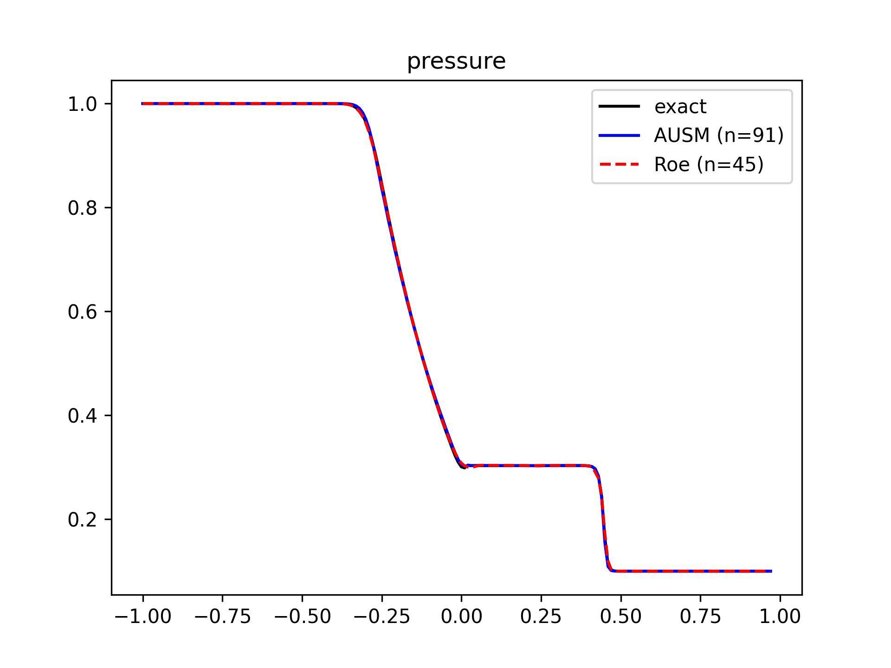

示例 1: 一维Euler方程组
===========================

激波管问题是验证 CFD 黎曼求解器的常用测试算例。

.. seealso::

   `Justin H., A Review on the Numerical Solution of the 1D Euler Equations, 2006
   <http://eprints.ma.man.ac.uk/150/1/JuH-EE.pdf>`_

   `Sod G., A survey of several finite difference methods for systems 
   of nonlinear hyperbolic conservation laws, Journal of Computational Physics,
   1978 <https://hal.archives-ouvertes.fr/hal-01635155/file/GAS.pdf>`_

(1) 离散方法
---------------------------

空间半离散形式 :eq:`euler-1d-c-discrete`, 
Roe 通量格式: :eq:`roe-flux-1-vec`,
一阶重构: :eq:`reconstruction-linear`。

时间推进的常微分方程 (:eq:`method-of-lines`) 可写作:

.. math:: 
   \frac{d \mathbf{U}_j}{d t} = 
   \mathbf{Q}_j (\mathbf{U}_{j-1}, \mathbf{U}_j, \mathbf{U}_{j+1})
   :label: euler-time-march-ode

- 有限体积方法
- 均匀结构网格
- 半离散方法
- 显式时间推进 (TVD 性质, 三阶精度)
- 二阶空间离散 (ROE 格式)
- 无边界条件

(2) 代码示例
---------------------------

以下为部分代码。
其中，调用的通量和重构格式参考 :eq:`roe-flux-1-vec`, :eq:`tvd-roe-u` 相关实现。

.. code-block:: python
    :linenos:

    def time_march_rhs(sol: np.ndarray, dx: float, dt: float) -> np.ndarray:
        '''
        Calculate the right hand side of the dU/dt=Q
        '''
        qq = np.zeros_like(sol)
        
        for i in range(2, N_POINTS-1):
            
            uUL, uUR = Reconstruction.Upwind1_TVD_eigen(
                sol[i-2,:], sol[i-1,:], sol[i,:], sol[i+1,:], 
                limiter=Reconstruction.min_mod, roe_average=Roe.average,
                dx=dx, dt=dt)

            fFaceL = Roe.flux_face(uUL, uUR)

            uUL, uUR = Reconstruction.Upwind1_TVD_eigen(
                sol[i-1,:], sol[i,:], sol[i+1,:], sol[i+2,:], 
                limiter=Reconstruction.min_mod, roe_average=Roe.average,
                dx=dx, dt=dt)

            fFaceR = Roe.flux_face(uUL, uUR)

            qq[i,:] = - (fFaceR - fFaceL)/dx
            
        return qq

    def RungeKutta3(sol: np.ndarray, dx: float, time_remain: float) -> np.ndarray:
        
        global_dt = time_step(sol, dx, CFL)
        
        global_dt = min(global_dt, time_remain)

        next_sol = sol.copy()
        
        #* Step 1
        qq = time_march_rhs(next_sol, dx, global_dt)
        next_sol = sol + global_dt*qq
        
        #* Step 2
        qq = time_march_rhs(next_sol, dx, global_dt)
        next_sol = 3/4*sol + 1/4*(next_sol + global_dt*qq)
        
        #* Step 3
        qq = time_march_rhs(next_sol, dx, global_dt)
        next_sol = 1/3*sol + 2/3*(next_sol + global_dt*qq)
        
        return next_sol, global_dt

    if __name__ == "__main__":
        
        mesh, current_solution, DX = initialization()
        CFL=1.2
        t0=0
        while t0<T0:
            current_solution, global_dt = RungeKutta3(current_solution, DX, T0-t0)
            t0 += global_dt

(3) 结果展示
---------------------------

   AUSM 矢通量分解格式, ROE 格式与精确解的对比

